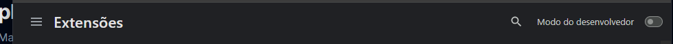
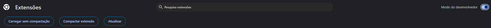
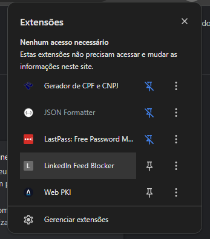

# LinkedIn Feed Blocker

Extensão para Chrome (Manifest V3) que oculta posts do feed do LinkedIn quando contêm palavras ou frases definidas pelo usuário. Funciona apenas em `https://www.linkedin.com/feed/*`.

## Estrutura do projeto

```
connexto-linkedin-feed-blocker/
├── manifest.json       # Manifest da extensão (MV3)
├── popup/
│   ├── popup.html      # Interface do popup
│   └── popup.js        # Carrega/salva palavras (chrome.storage.sync)
├── content/
│   └── content.js      # Observador do feed e lógica de bloqueio
├── scripts/
│   ├── load-in-chrome.sh   # Abre a página de extensões do Chrome e exibe o caminho da pasta (Linux/macOS)
│   └── load-in-chrome.bat  # O mesmo para Windows
├── docs/
│   ├── extensoes-modo-desenvolvedor.png       # Passo 1: Modo do desenvolvedor
│   ├── extensoes-carregar-sem-compactacao.png # Passo 2: Botão Carregar sem compactação
│   └── extensao-instalada.png                 # Passo 4: Extensão instalada na lista
└── README.md
```

## Instalador / distribuição

O Chrome não oferece instalador tradicional (ex.: .exe/.msi) para extensões. Você tem duas opções:

- **Chrome Web Store (instalação em um clique)**  
  Empacote a extensão em um zip e [publique na Chrome Web Store](https://developer.chrome.com/docs/webstore/publish). Os usuários instalam com "Adicionar ao Chrome" na página da loja. Há uma taxa única de registro.

- **Modo desenvolvedor (descompactado)**  
  Carregue a pasta do projeto como extensão descompactada. Siga as instruções abaixo para o seu sistema.

### Instruções de instalação (Linux, Windows, macOS)

Depois dos passos do seu sistema, faça no Chrome:

1. Ative o **Modo do desenvolvedor** (alternador no canto superior direito da página de extensões).

   

2. Clique em **Carregar sem compactação** (o botão aparece com o Modo do desenvolvedor ativado).

   

3. Selecione a pasta da extensão (a que contém o `manifest.json`).
4. A extensão aparecerá na barra de ferramentas e na lista de extensões (ícone de quebra-cabeça).

   

#### Linux

1. Abra um terminal e vá até a pasta do projeto:  
   `cd /caminho/para/connexto-linkedin-feed-blocker`
2. Torne o script executável (uma vez):  
   `chmod +x scripts/load-in-chrome.sh`
3. Execute:  
   `./scripts/load-in-chrome.sh`
4. O script exibe o caminho completo da pasta da extensão e tenta abrir o Chrome em `chrome://extensions`. Se o Chrome não abrir, acesse `chrome://extensions` manualmente.
5. Siga os passos do Chrome acima (Modo do desenvolvedor → Carregar sem compactação → selecione o caminho da pasta exibido pelo script).

#### Windows

1. Abra o Explorador de Arquivos e vá até a pasta do projeto (onde está o `manifest.json`).
2. Dê um duplo clique em `scripts\load-in-chrome.bat`, ou abra o Prompt de Comando / PowerShell nessa pasta e execute:  
   `scripts\load-in-chrome.bat`
3. O script exibe o caminho completo da pasta da extensão e abre o Chrome em `chrome://extensions`.
4. Siga os passos do Chrome acima (Modo do desenvolvedor → Carregar sem compactação → selecione o caminho da pasta exibido na janela do script).
5. Feche a janela do script quando terminar (pressione qualquer tecla se aparecer "Pressione qualquer tecla para continuar").

#### macOS

1. Abra o Terminal (Aplicativos → Utilitários → Terminal, ou pressione Cmd+Espaço e digite "Terminal").
2. Vá até a pasta do projeto:  
   `cd /caminho/para/connexto-linkedin-feed-blocker`
3. Torne o script executável (uma vez):  
   `chmod +x scripts/load-in-chrome.sh`
4. Execute:  
   `./scripts/load-in-chrome.sh`
5. O script exibe o caminho completo da pasta da extensão e tenta abrir o Chrome em `chrome://extensions`. Se o Chrome não abrir, acesse `chrome://extensions` manualmente no Chrome.
6. Siga os passos do Chrome acima (Modo do desenvolvedor → Carregar sem compactação → selecione o caminho da pasta exibido pelo script).

## Como utilizar

1. Acesse o [Feed do LinkedIn](https://www.linkedin.com/feed/).
2. Clique no ícone da extensão na barra de ferramentas do Chrome para abrir o popup.
3. No campo de texto, digite uma palavra ou frase por linha (não diferencia maiúsculas de minúsculas).
4. Clique em **Salvar** para gravar as palavras.
5. Recarregue a página do feed (F5 ou atualizar) para as novas palavras entrarem em vigor.
6. Posts que contiverem qualquer uma das palavras ou frases salvas serão ocultados. Novos posts carregados ao rolar a página são processados automaticamente.

## Como atualizar a extensão

Depois de alterar o código (popup, content script, manifest etc.):

1. Abra **chrome://extensions** no Chrome.
2. Localize **LinkedIn Feed Blocker**.
3. Clique no ícone **Atualizar** (seta circular) no card da extensão.

O Chrome recarrega a extensão e as mudanças passam a valer. Se o feed do LinkedIn já estiver aberto, recarregue a página (F5) para o content script ser injetado de novo.

## Requisitos

- Google Chrome compatível com Manifest V3.
- Sem backend, frameworks ou bibliotecas externas; usa apenas APIs do Chrome e o DOM.
